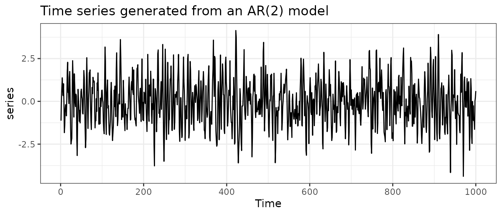
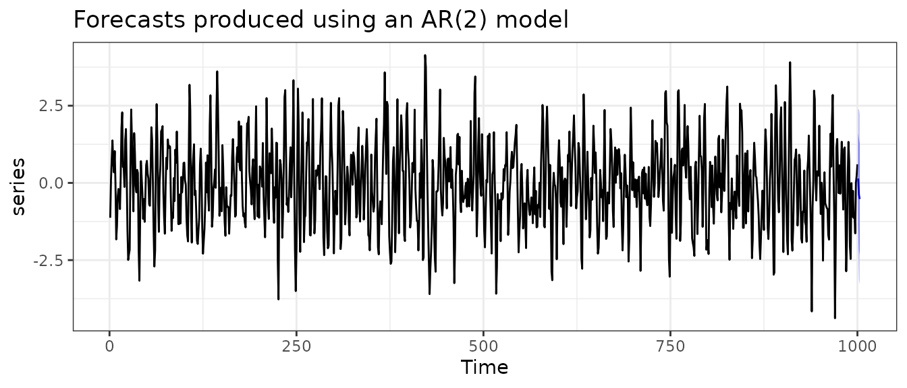
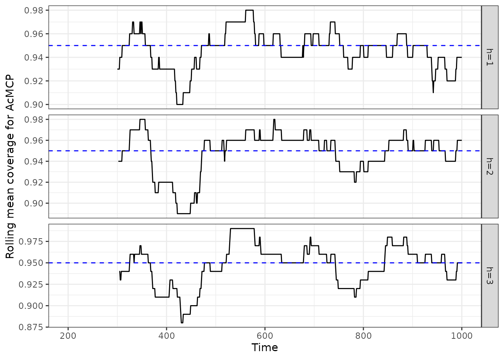
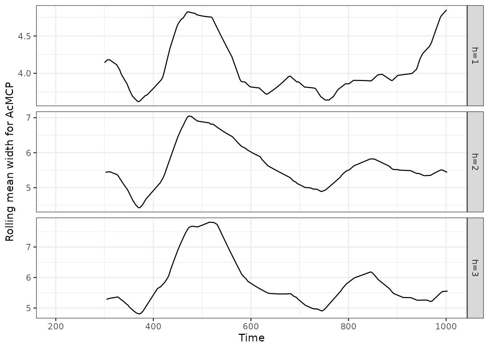
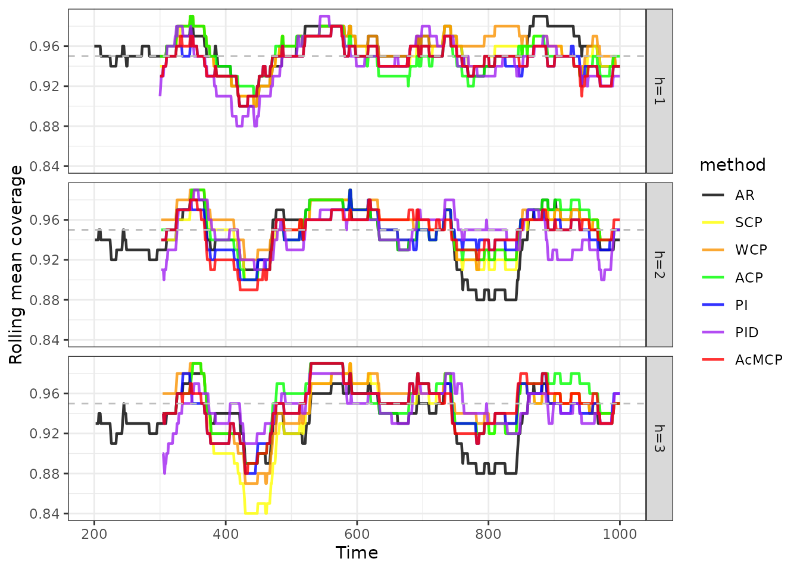
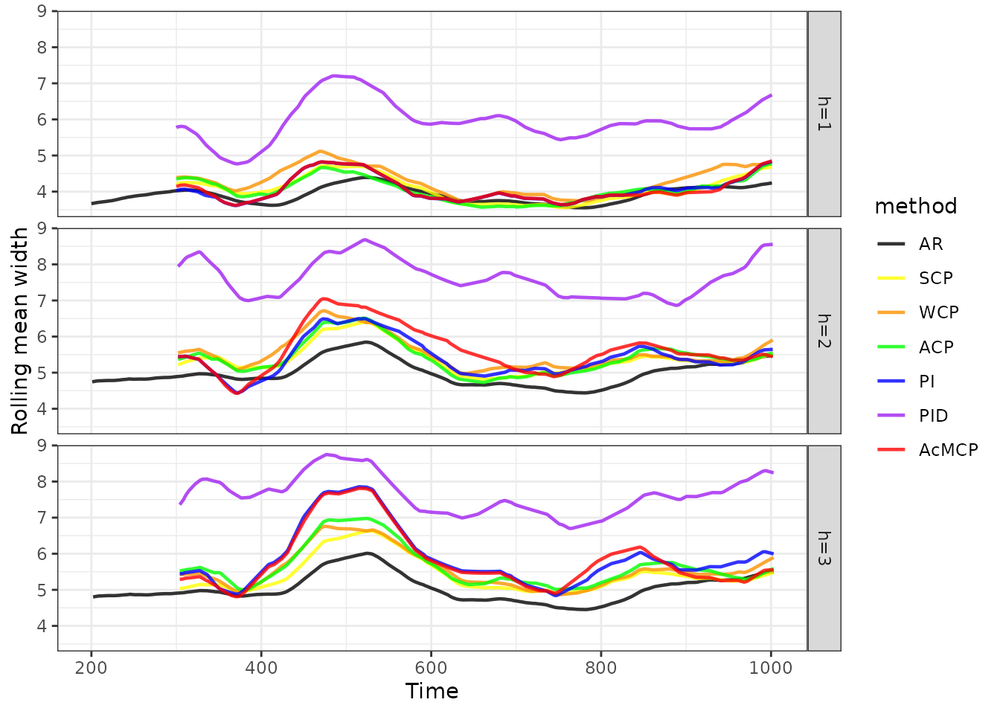

# Introduction to conformalForecast

The *conformalForecast* package implements conformal prediction methods
for **multistep-ahead** time series forecasting. Given a point
forecasting model and a validation set of past forecast errors, these
methods construct prediction intervals that are distribution-free: they
do not rely on an assumed error distribution (such as Gaussian errors),
and instead calibrate directly from the empirical behaviour of past
errors.

The package provides four conformal methods: split conformal prediction
([`scp()`](https://xqnwang.github.io/conformalForecast/reference/scp.md)),
adaptive conformal prediction
([`acp()`](https://xqnwang.github.io/conformalForecast/reference/acp.md)),
conformal PID control
([`pid()`](https://xqnwang.github.io/conformalForecast/reference/pid.md))
and autocorrelated multistep-ahead conformal prediction
([`acmcp()`](https://xqnwang.github.io/conformalForecast/reference/acmcp.md)).
A unified
[`conformal()`](https://xqnwang.github.io/conformalForecast/reference/conformal.md)
function can call any of them by name. This vignette works through all
four, starting from the simplest (SCP) and ending with AcMCP, the main
contribution of the accompanying paper.

``` r

library(conformalForecast)
library(forecast)
library(ggplot2)
library(dplyr)
library(tibble)
library(tsibble)
```

## Data simulation

Suppose we want to forecast a time series generated from an AR(2) model
with \\\phi_1 = 0.8\\, \\\phi_2 = -0.5\\, and \\\sigma^2 = 1\\.

We simulate 1005 observations and hold the last five back: the first
1000 are used throughout the vignette, and the remaining five are used
later to demonstrate updating a fitted conformal object with newly
arrived data.

``` r

set.seed(0)
series_all <- arima.sim(n = 1005, list(ar = c(0.8, -0.5)), sd = sqrt(1))
series <- head(series_all, 1000)
new_data <- as.numeric(tail(series_all, 5))
autoplot(series) +
  labs(
    title = "Time series generated from an AR(2) model"
  ) +
  theme_bw()
```



## Time series cross-validation

Before we can calibrate any conformal method, we need a record of past
forecast errors to calibrate against. We obtain this with
[`cvforecast()`](https://xqnwang.github.io/conformalForecast/reference/cvforecast.md),
which repeatedly fits the AR(2) model on a rolling forecast origin and
produces out-of-sample point forecasts and errors at every origin, for
every forecast horizon up to `h`.

Two arguments control how the origins are laid out. `forward = TRUE`
appends an extra \\h\\-step forecast made from the final observation, so
that the object carries genuinely future forecasts as well as the
validation history. `window` sets how many recent observations each
refit sees: a number gives a fixed-length rolling estimation window,
while `window = NULL` lets the estimation window expand over time. A
non-`NULL` `level` is required, since the conformal methods calibrate
against the nominal levels stored in the object.

``` r

far2 <- function(x, h, level) {
  Arima(x, order = c(2, 0, 0)) |> forecast(h = h, level)
}
fc <- cvforecast(series, forecastfun = far2, h = 3, level = c(80, 95),
                 forward = TRUE, window = 100, initial = 1)
summary(fc)
#> Cross-validation
#> 
#> Call:
#>  cvforecast(y = series, forecastfun = far2, h = 3, level = c(80,  
#>      95), forward = TRUE, initial = 1, window = 100) 
#> 
#>  fit_times = 901 (the forward step included) 
#> 
#> Forecasts of the forward step:
#>      Point Forecast     Lo 80    Hi 80     Lo 95    Hi 95
#> 1001      0.1430927 -1.317635 1.603821 -2.090898 2.377083
#> 1002     -0.3763649 -2.181868 1.429138 -3.137644 2.384914
#> 1003     -0.5230650 -2.328976 1.282846 -3.284968 2.238838
#> 
#> Cross-validation error measures:
#>        ME   MAE   MSE  RMSE    MPE   MAPE  MASE RMSSE Winkler_95 MSIS_95
#> CV -0.018 0.972 1.506 1.102 36.202 218.01 0.947 0.866      5.765   5.616
```

``` r

fc |>
  autoplot() +
  labs(
    title = "Forecasts produced using an AR(2) model"
  ) +
  theme_bw()
```



``` r

(fc_score <- accuracy(fc, byhorizon = TRUE))
#>        Winkler_95  MSIS_95
#> CV h=1   4.784124 4.659562
#> CV h=2   6.247227 6.090071
#> CV h=3   6.269019 6.105162
(fc_cov <- coverage(fc, window = 100, level = 95))
#>       h=1       h=2       h=3 
#> 0.9544444 0.9421580 0.9354120
(fc_wid <- width(fc, window = 100, level = 95, includemedian = TRUE))
#> Mean width:
#>      h=1      h=2      h=3 
#> 3.915949 4.999164 5.049476 
#> 
#> Median width:
#>      h=1      h=2      h=3 
#> 3.885016 4.919813 4.957593
```

The object `fc` stores point forecasts `MEAN` and forecast errors
`ERROR` as multivariate time series, in which column \\h\\ holds the
values for forecast horizon \\h\\. In package notation, the error made
forecasting \\y\_{t+h}\\ from origin \\t\\ is \\e\_{t+h\|t} = y\_{t+h} -
\hat{y}\_{t+h\|t}.\\ Every conformal method below calibrates against
this `ERROR` matrix, one column (one horizon) at a time.

## Conformal prediction

The four methods differ in how the quantile used to build the intervals
is obtained, from a plain empirical quantile of past scores in SCP to an
online recursion in the later methods. They are presented below in that
order.

### The `conformal()` function

All four methods share the same calling convention: they accept a
`cvforecast` object, or a previous conformal fit when updating, and
return prediction intervals for one or more nominal levels. The
[`conformal()`](https://xqnwang.github.io/conformalForecast/reference/conformal.md)
function provides a unified interface to these methods, which can be
selected through its `method` argument:

| `method` | function | core idea |
|:---|:---|:---|
| “scp” | [`scp()`](https://xqnwang.github.io/conformalForecast/reference/scp.md) | Empirical quantile of past nonconformity scores, on an expanding or rolling calibration window |
| “acp” | [`acp()`](https://xqnwang.github.io/conformalForecast/reference/acp.md) | Online update of the miscoverage target alpha in response to whether the last interval covered |
| “pid” | [`pid()`](https://xqnwang.github.io/conformalForecast/reference/pid.md) | P (quantile tracking) + I (error integration) + D (scorecasting) applied per horizon |
| “acmcp” | [`acmcp()`](https://xqnwang.github.io/conformalForecast/reference/acmcp.md) | Same P+I+D structure as PID, but the scorecaster exploits correlation across horizons |

`conformal(fc, method = "scp", ...)` is exactly equivalent to
`scp(fc, ...)`:
[`conformal()`](https://xqnwang.github.io/conformalForecast/reference/conformal.md)
forwards `object` and `...` to the chosen function and returns its
result unchanged. The rest of this vignette calls
[`scp()`](https://xqnwang.github.io/conformalForecast/reference/scp.md),
[`acp()`](https://xqnwang.github.io/conformalForecast/reference/acp.md),
[`pid()`](https://xqnwang.github.io/conformalForecast/reference/pid.md)
and
[`acmcp()`](https://xqnwang.github.io/conformalForecast/reference/acmcp.md)
directly, to keep the method-specific arguments explicit.

A few arguments recur across the methods and mean much the same thing
everywhere. `ncal` is the length of the calibration history: for SCP and
ACP it is the number of past scores the quantile is computed from, while
for PID and AcMCP, which track the quantile recursively, it acts as a
burn-in length before the recursion starts producing intervals.
`rolling = TRUE` restricts that history to the most recent `ncal` errors
wherever a window is used; `rolling = FALSE` (the default) lets it
expand over time. `symmetric` chooses between calibrating absolute
errors (`TRUE`) and calibrating the lower and upper tails separately
(`FALSE`); AcMCP supports only the asymmetric case and therefore has no
`symmetric` argument.

Every method returns an object whose class vector is the method name
followed by `cpforecast`, `cvforecast` and `forecast`, so `cpforecast`
methods such as
[`accuracy()`](https://generics.r-lib.org/reference/accuracy.html),
[`coverage()`](https://xqnwang.github.io/conformalForecast/reference/coverage.md)
and
[`width()`](https://xqnwang.github.io/conformalForecast/reference/width.md)
apply to all four. Once you have one, you can extend it with newly
observed data without recomputing the whole history, using
[`update()`](https://rdrr.io/r/stats/update.html); see
[`vignette("update", package = "conformalForecast")`](https://xqnwang.github.io/conformalForecast/articles/update.md)
for details.

### Classical split conformal prediction (SCP)

SCP is the simplest of the four methods and a natural baseline. For each
horizon \\h\\, it forms a vector of nonconformity scores \\s\_{t+h\|t}\\
from past errors, and predicts an interval by adding and subtracting an
empirical quantile of those scores from the point forecast.

If `symmetric = TRUE`, the score is the absolute error, \\s\_{t+h\|t} =
\|e\_{t+h\|t}\|\\, and the \\(1-\alpha)\\-quantile \\\hat{q}\_{t+h\|t}\\
of the calibration scores gives a symmetric interval
\\\left\[\hat{y}\_{t+h\|t} - \hat{q}\_{t+h\|t},\\ \hat{y}\_{t+h\|t} +
\hat{q}\_{t+h\|t}\right\].\\ If `symmetric = FALSE` (the default we use
below), upper and lower bounds are calibrated separately from signed
scores, \\s^u\_{t+h\|t} = e\_{t+h\|t}\\ and \\s^l\_{t+h\|t} =
-e\_{t+h\|t}\\, using the \\(1-\alpha/2)\\-quantiles
\\\hat{q}^u\_{t+h\|t}\\ and \\\hat{q}^l\_{t+h\|t}\\ of the respective
scores, giving \\\left\[\hat{y}\_{t+h\|t} - \hat{q}^l\_{t+h\|t},\\
\hat{y}\_{t+h\|t} + \hat{q}^u\_{t+h\|t}\right\].\\ Asymmetric scoring
lets the interval be wider on one side than the other, which is useful
whenever the error distribution itself is skewed.

The calibration set the quantile is computed on can grow over time
(`rolling = FALSE`): at time \\t\\ it is the expanding set
\\s\_{1+h\|1}, \dots, s\_{t\|t-h}\\, using every score observed so far.
Or it can be a fixed-length trailing window (`rolling = TRUE`): a window
of `ncal` most recent scores. A rolling window adapts faster to a
changing error distribution but uses less data per quantile estimate; an
expanding window is more stable but slower to react if the error
distribution drifts. Below we use a rolling window of `ncal = 100`.

``` r

scpfc <- scp(fc, symmetric = FALSE, ncal = 100, rolling = TRUE,
             weightfun = NULL, kess = FALSE, quantiletype = 1)

(scpfc_score <- accuracy(scpfc, byhorizon = TRUE))
#>        Winkler_95  MSIS_95
#> CV h=1   5.003118 4.830704
#> CV h=2   6.527138 6.302017
#> CV h=3   6.635156 6.403022
(scpfc_cov <- coverage(scpfc, window = 100, level = 95))
#>       h=1       h=2       h=3 
#> 0.9500000 0.9473684 0.9396985
(scpfc_wid <- width(scpfc, window = 100, level = 95, includemedian = TRUE))
#> Mean width:
#>      h=1      h=2      h=3 
#> 4.114655 5.368746 5.403647 
#> 
#> Median width:
#>      h=1      h=2      h=3 
#> 4.054006 5.334842 5.326651
```

[`scp()`](https://xqnwang.github.io/conformalForecast/reference/scp.md)
also allows non-equal weighting of the calibration scores via
`weightfun`, a function that maps the number of scores in the
calibration set to a vector of weights. This lets more recent scores
count more toward the quantile than older ones, which is a middle ground
between a rolling window (hard cutoff) and an expanding window (no
decay). When weights are used, setting `kess = TRUE` computes the
quantile using Kish’s effective sample size, \\n\_{\mathrm{eff}} = (\sum
w)^2 / \sum w^2\\, rather than the raw number of scores, so the quantile
estimate reflects how much *effective* information the weighted sample
actually carries.

``` r

expweight <- function(n) 0.99^{n+1-(1:n)}
scpfc_exp <- scp(fc, symmetric = FALSE, ncal = 100, rolling = TRUE,
                 weightfun = expweight, kess = FALSE, quantiletype = 1)

(scpfc_exp_score <- accuracy(scpfc_exp, byhorizon = TRUE))
#>        Winkler_95  MSIS_95
#> CV h=1   5.108981 4.930413
#> CV h=2   6.563368 6.336281
#> CV h=3   6.615147 6.381920
(scpfc_exp_cov <- coverage(scpfc_exp, window = 100, level = 95))
#>       h=1       h=2       h=3 
#> 0.9550000 0.9548872 0.9484925
(scpfc_exp_wid <- width(scpfc_exp, window = 100, level = 95, includemedian = TRUE))
#> Mean width:
#>      h=1      h=2      h=3 
#> 4.322785 5.567499 5.585576 
#> 
#> Median width:
#>      h=1      h=2      h=3 
#> 4.297306 5.455463 5.499007
```

SCP is the right choice when you want a simple, well-understood baseline
and the error distribution within the calibration window is reasonably
stable; it does not adapt online to feedback about whether recent
intervals actually covered, which is exactly what the later methods add.

### Adaptive conformal prediction (ACP)

ACP (Gibbs and Candes 2021) keeps the SCP calibration mechanics but
replaces the fixed miscoverage level \\\alpha\\ with one that adapts
online. For symmetric intervals, a single level is updated according to
\\\alpha\_{t+h\|t} := \alpha\_{t+h-1\|t-1} + \gamma\left(\alpha -
\mathrm{err}\_{t\|t-h}\right),\\ where \\\mathrm{err}\_{t\|t-h} = 1\\
indicates a miss and \\0\\ a hit. For asymmetric intervals, as used
below, the lower and upper tails are updated separately:
\\\begin{aligned} \alpha^l\_{t+h\|t} &:= \alpha^l\_{t+h-1\|t-1} +
\gamma\left(\alpha/2 - \mathrm{err}^l\_{t\|t-h}\right),\\
\alpha^u\_{t+h\|t} &:= \alpha^u\_{t+h-1\|t-1} + \gamma\left(\alpha/2 -
\mathrm{err}^u\_{t\|t-h}\right), \end{aligned}\\ where
\\\mathrm{err}^l\\ and \\\mathrm{err}^u\\ indicate misses below and
above the interval, respectively. The symmetric level is initialized at
\\\alpha\\, while both tail-specific levels are initialized at
\\\alpha/2\\. Each recursion is computed separately for every horizon
\\h\\. A miss pushes the corresponding level down and widens that side
of the next interval, while a hit pushes it up. At each step, the
quantile is still computed from an expanding or rolling calibration
window, as in SCP, but uses the current adaptive level.

The step size \\\gamma \> 0\\ (argument `gamma`) controls how fast
\\\alpha\\ reacts: larger values adapt more quickly to a change in the
underlying error distribution but make the interval width more volatile;
smaller values are steadier but slower to correct a persistent
miscoverage. This adaptivity is what lets ACP maintain close-to-nominal
long-run coverage under distribution shift, where an SCP quantile
computed from a stale calibration window would not.

``` r

acpfc <- acp(fc, symmetric = FALSE, gamma = 0.005, ncal = 100, rolling = TRUE)

(acpfc_score <- accuracy(acpfc, byhorizon = TRUE))
#>        Winkler_95  MSIS_95
#> CV h=1   5.036517 4.863717
#> CV h=2   6.644759 6.416735
#> CV h=3   6.785646 6.551065
(acpfc_cov <- coverage(acpfc, window = 100, level = 95))
#>       h=1       h=2       h=3 
#> 0.9487500 0.9498747 0.9497487
(acpfc_wid <- width(acpfc, window = 100, level = 95, includemedian = TRUE))
#> Mean width:
#>      h=1      h=2      h=3 
#> 4.119178 5.420955 5.635120 
#> 
#> Median width:
#>      h=1      h=2      h=3 
#> 4.034989 5.426268 5.499007
```

### Conformal PID control (PID)

PID (Angelopoulos, Candes, and Tibshirani 2023) generalizes ACP by
tracking the quantile \\q\_{t+h\|t}\\ itself (rather than \\\alpha\\)
through three additive components, evocative of a
proportional-integral-derivative controller. For symmetric intervals,
the recursion is \\q\_{t+h\|t}=\underbrace{q\_{t+h-1\|t-1} +
\eta\left(\mathrm{err}\_{t\|t-h}-\alpha\right)}\_{\text{P}} +
\underbrace{r_t\\\left(\sum\_{i=1}^t\left(\mathrm{err}\_{i\|i-h}-\alpha\right)\right)}\_{\text{I}} +
\underbrace{\hat{s}\_{t+h\|t}}\_{\text{D}},\\ computed separately for
each horizon \\h\\. For asymmetric intervals, as used in both examples
below, the lower and upper quantiles follow separate recursions. For \\b
\in \\l,u\\\\, \\q^b\_{t+h\|t}=q^b\_{t+h-1\|t-1} +
\eta\left(\mathrm{err}^b\_{t\|t-h}-\alpha/2\right) +
r_t\\\left(\sum\_{i=1}^t\left(\mathrm{err}^b\_{i\|i-h}-\alpha/2\right)\right) +
\hat{s}^b\_{t+h\|t}.\\

- The P term, quantile tracking, applies the same idea as ACP’s
  \\\alpha\\ update directly to the quantile, with each quantile
  initialized at \\0\\. Its target is \\\alpha\\ for symmetric intervals
  and \\\alpha/2\\ for each tail of an asymmetric interval. The step
  size \\\eta\\ (argument `lr`) is scaled internally by the recent range
  of the errors, so it adapts to the level of forecast uncertainty
  rather than being a fixed number of score units.
- The I term, error integration, corrects a persistent bias in realized
  coverage, which the memoryless P term reacts to only slowly. It feeds
  the corresponding cumulative miscoverage through a nonlinear
  saturation function \\r_t(x) = K\_{\mathrm{I}} \tan\\\left(\frac{x
  \log(t)}{t\\ C\_{\mathrm{sat}}}\right),\\ where \\\tan(x) =
  \mathrm{sign}(x)\cdot\infty\\ once \\x \notin \[-\pi/2, \pi/2\]\\.
  \\C\_{\mathrm{sat}}\\ and \\K\_{\mathrm{I}}\\ are positive constants
  chosen heuristically: \\K\_{\mathrm{I}}\\ (argument `KI`) puts the
  integrator on the same scale as the scores, and \\C\_{\mathrm{sat}}\\
  (argument `Csat`) is chosen so that, by a target time `Tg`, the method
  achieves at least \\1-\alpha-\delta\\ absolute coverage for a chosen
  tolerance `delta`. You can either supply `Csat` directly, as we do
  below, or leave it at its default of `NULL` and let it be derived from
  `Tg` and `delta`; in the latter case `Tg` must be greater than 1 and
  `delta` must lie in \\(0, 1)\\. Setting `integrate = FALSE` drops this
  term entirely.
- The D term, scorecasting, adds a forecast of the nonconformity score
  itself, \\\hat{s}\_{t+h\|t}\\, produced by fitting a user-supplied
  `scorecastfun` to the scores observed so far. This anticipates
  predictable structure in the scores (a trend, a seasonal pattern)
  instead of only reacting to it after the fact. Set `scorecast = FALSE`
  to omit this term, or supply, e.g., a naive forecaster as below.

``` r

# PID setup
Tg <- 1000; delta <- 0.01
Csat <- 2 / pi * (ceiling(log(Tg) * delta) - 1 / log(Tg))
KI <- 2
lr <- 0.1
```

``` r

# PID without scorecaster
pidfc_nsf <- pid(fc, symmetric = FALSE, ncal = 100, rolling = TRUE,
                 integrate = TRUE, scorecast = FALSE,
                 lr = lr, Tg = Tg, KI = KI, Csat = Csat)

(pidfc_nsf_score <- accuracy(pidfc_nsf, byhorizon = TRUE))
#>        Winkler_95  MSIS_95
#> CV h=1   5.122446 4.948241
#> CV h=2   6.760180 6.529263
#> CV h=3   6.962396 6.718390
(pidfc_nsf_cov <- coverage(pidfc_nsf, window = 100, level = 95))
#>       h=1       h=2       h=3 
#> 0.9437500 0.9461153 0.9447236
(pidfc_nsf_wid <- width(pidfc_nsf, window = 100, level = 95, includemedian = TRUE))
#> Mean width:
#>      h=1      h=2      h=3 
#> 4.129826 5.443648 5.878857 
#> 
#> Median width:
#>      h=1      h=2      h=3 
#> 4.051401 5.450223 5.748390
```

``` r

# PID with a Naive method as the scorecaster
naivefun <- function(x, h) {
  naive(x) |> forecast(h = h)
}
pidfc <- pid(fc, symmetric = FALSE, ncal = 100, rolling = TRUE,
             integrate = TRUE, scorecast = TRUE, scorecastfun = naivefun,
             lr = lr, Tg = Tg, KI = KI, Csat = Csat)

(pidfc_score <- accuracy(pidfc, byhorizon = TRUE))
#>        Winkler_95  MSIS_95
#> CV h=1   7.127771 6.889720
#> CV h=2   9.341393 9.032121
#> CV h=3  10.042744 9.711128
(pidfc_cov <- coverage(pidfc, window = 100, level = 95))
#>       h=1       h=2       h=3 
#> 0.9387500 0.9411028 0.9409548
(pidfc_wid <- width(pidfc, window = 100, level = 95, includemedian = TRUE))
#> Mean width:
#>      h=1      h=2      h=3 
#> 6.004732 7.686964 7.618278 
#> 
#> Median width:
#>      h=1      h=2      h=3 
#> 5.972480 7.664302 7.656036
```

PID is a good choice when you want both the persistent-bias correction
that ACP lacks (via I) and the ability to plug in domain knowledge about
the score dynamics (via D, through the scorecaster). Its scorecaster is
trained separately at each horizon \\h\\, using only that horizon’s own
score history, and therefore does not model dependence across horizons.
AcMCP closes this gap without using future realized errors.

### Autocorrelated multistep-ahead conformal prediction (AcMCP)

AcMCP (Wang and Hyndman 2024) keeps PID’s P+I+D structure, and supports
only asymmetric (signed-error) scores, but replaces the scorecaster in
the D term. The scorecaster averages two forecasts: an
\\\mathrm{MA}(h-1)\\ model fitted to the historical horizon-\\h\\
errors, and a linear regression of historical horizon-\\h\\ errors on
shorter-horizon errors aligned by forecast origin. At prediction origin
\\t\\, the errors \\e\_{t+1\|t}, \dots, e\_{t+h-1\|t}\\ are not yet
observed, so the regression uses their recursively generated scorecasts
instead. At \\h=1\\, where there is no shorter-horizon input, the
scorecaster falls back to a simple mean forecast.

This exploits the correlation between horizons. Optimal \\h\\-step-ahead
forecast errors are serially correlated up to lag \\h-1\\ under general
nonstationary autoregressive data-generating processes. AcMCP estimates
this dependence from historical errors available by the prediction
origin and recursively constructs the shorter-horizon inputs needed to
scorecast horizon \\h\\. The guarantee being targeted is asymptotic
marginal coverage. Realized coverage will fluctuate around the nominal
level in any finite validation set, more so at longer horizons.

Two practical points follow from the way this scorecaster is built. The
MA component is fitted by CSS-ML estimation by default, matching the
reference implementation; `ma_method = "CSS"` is available and is faster
at longer forecast horizons, at the cost of somewhat different
estimates. And because the regression at horizon \\h\\ consumes the
scorecasts made at horizons \\1, \dots, h-1\\, the scorecasts are
constructed recursively: the first scorecast for horizon \\h\\ only
becomes available at cross-validation error index \\n\_{\mathrm{cal}} +
h(h-1)/2\\.

``` r

acmcpfc <- acmcp(fc, ncal = 100, rolling = TRUE, integrate = TRUE, scorecast = TRUE,
                 lr = lr, Tg = Tg, KI = KI, Csat = Csat)

(acmcpfc_score <- accuracy(acmcpfc, byhorizon = TRUE))
#>        Winkler_95  MSIS_95
#> CV h=1   5.159843 4.984948
#> CV h=2   6.664827 6.437713
#> CV h=3   6.904946 6.662531
(acmcpfc_cov <- coverage(acmcpfc, window = 100, level = 95))
#>       h=1       h=2       h=3 
#> 0.9437500 0.9473684 0.9447236
(acmcpfc_wid <- width(acmcpfc, window = 100, level = 95, includemedian = TRUE))
#> Mean width:
#>      h=1      h=2      h=3 
#> 4.134144 5.601782 5.796113 
#> 
#> Median width:
#>      h=1      h=2      h=3 
#> 4.068763 5.561382 5.562705
```

## Updating with new observations

When new observations become available,
[`update()`](https://rdrr.io/r/stats/update.html) extends the
cross-validation forecasts and the conformal intervals without
recomputing the results that are already there. It replays the conformal
settings stored in the fitted object, so the extension is made under
exactly the same configuration as the original fit.

``` r

scpfc_updated <- update(scpfc, new_data = new_data, forecastfun = far2)
length(scpfc_updated$x)
#> [1] 1005
scpfc_updated$mean
#> Time Series:
#> Start = 1006 
#> End = 1008 
#> Frequency = 1 
#> [1]  0.279596189  0.457719582 -0.001123158
```

This is only a first look;
[`vignette("update", package = "conformalForecast")`](https://xqnwang.github.io/conformalForecast/articles/update.md)
covers updating in full, including which methods can resume from stored
state and what has to match for them to do so.

## Forecasting with external regressors

If the forecasting model uses external regressors, `forecastfun` should
accept `xreg` for the training period and `newxreg` for the forecast
period. The following smaller example uses the first 300 observations of
the simulated series and reserves the next five for updating.

``` r

far2_xreg <- function(x, h, level, xreg, newxreg) {
  Arima(x, order = c(2, 0, 0), xreg = xreg) |>
    forecast(h = h, level = level, xreg = newxreg)
}

n <- 300
h <- 3
n_update <- 5
series_xreg <- head(series_all, n)
new_data_xreg <- as.numeric(series_all[n + seq_len(n_update)])
xreg_all <- cbind(
  trend = seq_len(n + h + n_update),
  cycle = sin(2 * pi * seq_len(n + h + n_update) / 12)
)

fc_xreg <- cvforecast(
  series_xreg,
  forecastfun = far2_xreg,
  h = h,
  level = 95,
  forward = TRUE,
  window = 100,
  xreg = xreg_all[seq_len(n + h), ]
)
scpfc_xreg <- conformal(
  fc_xreg,
  method = "scp",
  symmetric = FALSE,
  ncal = 100,
  rolling = TRUE
)
```

This chunk also shows the unified interface in use:
`conformal(fc_xreg, method = "scp", ...)` does exactly what a direct
call to
[`scp()`](https://xqnwang.github.io/conformalForecast/reference/scp.md)
would do.

With `forward = TRUE`, the stored `xreg` already contains the original
\\h\\ future rows. Therefore, `new_xreg` supplies the rows immediately
after the stored predictor matrix, keeping the next forecast horizon
available after the update. It must have one row per new observation and
the same columns as the stored `xreg`.

``` r

scpfc_xreg_updated <- update(
  scpfc_xreg,
  new_data = new_data_xreg,
  forecastfun = far2_xreg,
  new_xreg = xreg_all[n + h + seq_len(n_update), ]
)
scpfc_xreg_updated$mean
#> Time Series:
#> Start = 306 
#> End = 308 
#> Frequency = 1 
#> [1]  0.9768456  0.3894413 -0.3477063
```

## Coverage and width of prediction intervals

Taking the AcMCP result as an example, we now look at the rolling
average coverage on the validation set.

``` r

acmcpfc_cov$rollmean |>
  as_tsibble() |>
  mutate(horizon = key, coverage = value) |>
  update_tsibble(key = horizon) |>
  select(-c(key, value)) |>
  ggplot(aes(x = index, y = coverage, group = horizon)) +
  geom_line() +
  geom_hline(yintercept = 0.95, linetype = "dashed", color = "blue") +
  facet_grid(horizon~., scales = "free_y") +
  xlab("Time") +
  ylab("Rolling mean coverage for AcMCP") +
  theme_bw()
```



We can similarly look at the rolling average interval width on the
validation set.

``` r

acmcpfc_wid$rollmean |>
  as_tsibble() |>
  mutate(horizon = key, width = value) |>
  update_tsibble(key = horizon) |>
  select(-c(key, value)) |>
  ggplot(aes(x = index, y = width, group = horizon)) +
  geom_line() +
  facet_grid(horizon~., scales = "free_y") +
  xlab("Time") +
  ylab("Rolling mean width for AcMCP") +
  theme_bw()
```



Finally, we combine the results from all the methods considered above
into a single comparison: the underlying AR(2) model’s own intervals
(`AR`), SCP with equal weights (`SCP`), weighted conformal prediction
with exponential weights (`WCP`), ACP, proportional-integral control
without scorecasting (`PI`), PID with a naive scorecaster (`PID`), and
AcMCP.

The comparison is based on a single simulated series and is intended
only to illustrate the output; it should not be used to rank the
methods.

``` r

candidates <- c("fc", "scpfc", "scpfc_exp", "acpfc", "pidfc_nsf", "pidfc", "acmcpfc")
methods <- c("AR", "SCP", "WCP", "ACP", "PI", "PID", "AcMCP")
for (i in 1:length(candidates)) {
  out <- get(paste0(candidates[i], "_cov"))
  out_pivot <- out$rollmean |>
    as_tsibble() |>
    mutate(horizon = key, coverage = value) |>
    update_tsibble(key = horizon) |>
    select(-c(key, value)) |>
    mutate(method = methods[i]) |>
    as_tibble()
  assign(paste0(methods[i], "_cov"), out_pivot)
}
cov <- bind_rows(mget(paste0(methods, "_cov")))

cols <- c(
  "AR" = "black",
  "SCP" = "yellow",
  "WCP" = "#fa9200",
  "ACP" = "green",
  "PI" = "blue",
  "PID" = "purple",
  "AcMCP" = "red"
)
cov |>
  as_tsibble(index = index, key = c(horizon, method)) |>
  mutate(method = factor(method, levels = methods)) |>
  ggplot(aes(x = index, y = coverage, group = method, colour = method)) +
  geom_line(linewidth = 0.8, alpha = 0.8) +
  scale_colour_manual(values = cols) +
  geom_hline(yintercept = 0.95, linetype = "dashed", colour = "gray") +
  facet_grid(horizon~.) +
  xlab("Time") +
  ylab("Rolling mean coverage") +
  theme_bw()
```



``` r

cov_mean <- lapply(1:length(candidates), function(i) {
  out_cov <- get(paste0(candidates[i], "_cov"))
  out_score <- get(paste0(candidates[i], "_score"))
  out_mean <- data.frame(
      method = methods[i],
      covmean = as.vector(out_cov$mean),
      winkler = as.vector(out_score[, "Winkler_95"]),
      msis = as.vector(out_score[,"MSIS_95"])
    ) |>
    as_tibble() |>
    rownames_to_column("horizon") |>
    mutate(horizon = paste0("h=", horizon))
  out_mean
})
cov_mean <- do.call(bind_rows, cov_mean) |>
  mutate(method = factor(method, levels = methods)) |>
  mutate(covdiff = covmean - 0.95) |>
  arrange(horizon, method)
print(cov_mean, n = nrow(cov_mean))
#> # A tibble: 21 × 6
#>    horizon method covmean winkler  msis   covdiff
#>    <chr>   <fct>    <dbl>   <dbl> <dbl>     <dbl>
#>  1 h=1     AR       0.954    4.78  4.66  0.00444 
#>  2 h=1     SCP      0.95     5.00  4.83  0       
#>  3 h=1     WCP      0.955    5.11  4.93  0.00500 
#>  4 h=1     ACP      0.949    5.04  4.86 -0.00125 
#>  5 h=1     PI       0.944    5.12  4.95 -0.00625 
#>  6 h=1     PID      0.939    7.13  6.89 -0.0112  
#>  7 h=1     AcMCP    0.944    5.16  4.98 -0.00625 
#>  8 h=2     AR       0.942    6.25  6.09 -0.00784 
#>  9 h=2     SCP      0.947    6.53  6.30 -0.00263 
#> 10 h=2     WCP      0.955    6.56  6.34  0.00489 
#> 11 h=2     ACP      0.950    6.64  6.42 -0.000125
#> 12 h=2     PI       0.946    6.76  6.53 -0.00388 
#> 13 h=2     PID      0.941    9.34  9.03 -0.00890 
#> 14 h=2     AcMCP    0.947    6.66  6.44 -0.00263 
#> 15 h=3     AR       0.935    6.27  6.11 -0.0146  
#> 16 h=3     SCP      0.940    6.64  6.40 -0.0103  
#> 17 h=3     WCP      0.948    6.62  6.38 -0.00151 
#> 18 h=3     ACP      0.950    6.79  6.55 -0.000251
#> 19 h=3     PI       0.945    6.96  6.72 -0.00528 
#> 20 h=3     PID      0.941   10.0   9.71 -0.00905 
#> 21 h=3     AcMCP    0.945    6.90  6.66 -0.00528
```

``` r

for (i in 1:length(candidates)) {
  out <- get(paste0(candidates[i], "_wid"))
  out_pivot <- out$rollmean |>
    as_tsibble() |>
    mutate(horizon = key, width = value) |>
    update_tsibble(key = horizon) |>
    select(-c(key, value)) |>
    mutate(method = methods[i]) |>
    as_tibble()
  assign(paste0(methods[i], "_wid"), out_pivot)
}
wid <- bind_rows(mget(paste0(methods, "_wid")))

wid |>
  as_tsibble(index = index, key = c(horizon, method)) |>
  mutate(method = factor(method, levels = methods)) |>
  ggplot(aes(x = index, y = width, group = method, colour = method)) +
  geom_line(linewidth = 0.8, alpha = 0.8) +
  scale_colour_manual(values = cols) +
  facet_grid(horizon~.) +
  xlab("Time") +
  ylab("Rolling mean width") +
  theme_bw()
```



## References

Angelopoulos, A., Candes, E., and Tibshirani, R. J. (2023). “Conformal
PID control for time series prediction”. *Advances in Neural Information
Processing Systems*, 36, 23047–23074.

Gibbs, I., and Candes, E. (2021). “Adaptive conformal inference under
distribution shift”. *Advances in Neural Information Processing
Systems*, 34, 1660–1672.

Wang, X., and Hyndman, R. J. (2024). “Online conformal inference for
multi-step time series forecasting”. arXiv:2410.13115.
<https://doi.org/10.48550/arXiv.2410.13115>
