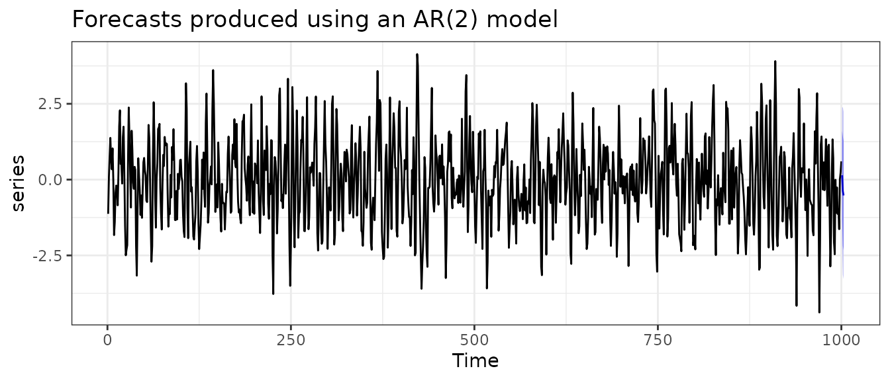
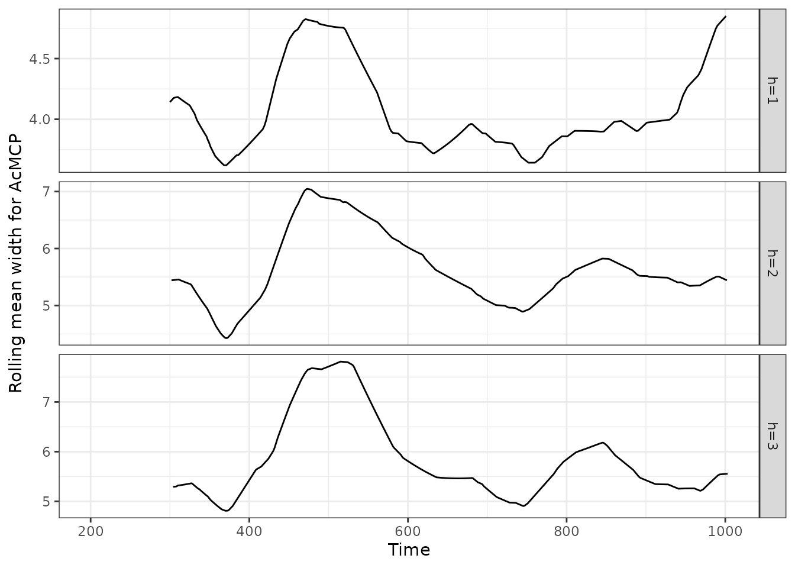
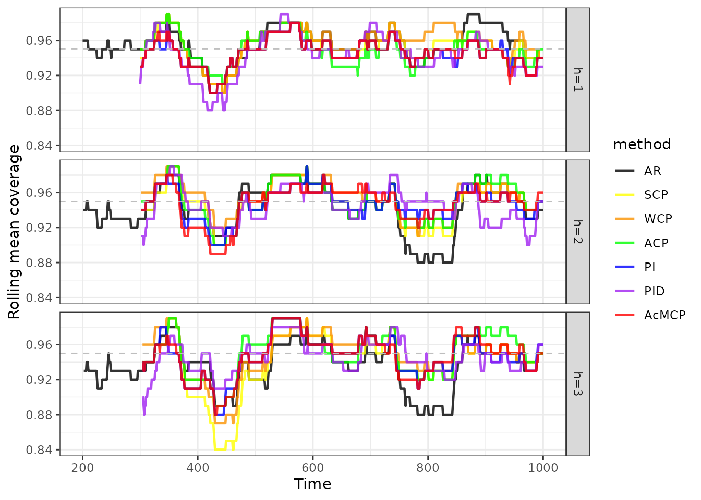

# Introduction to conformalForecast

The *conformalForecast* package provides some commonly used conformal
prediction methods for time series forecasting.

``` r
library(conformalForecast)
library(forecast)
library(ggplot2)
library(dplyr)
library(tibble)
library(tsibble)
```

## Data simulation

Suppose we are interested in forecasting a time series data generated
from an AR(2) model with $\phi_{1} = 0.8$, $\phi_{2} = - 0.5$, and
$\sigma^{2} = 1$.

``` r
set.seed(0)
series <- arima.sim(n = 1000, list(ar = c(0.8, -0.5)), sd = sqrt(1))
autoplot(series) +
  labs(
    title = "Time series generated from an AR(2) model",
    ylab = ""
  ) +
  theme_bw()
```


## Time series cross-validation

We first train a forecasting model AR(2) on a rolling forecast origin to
generate forecasts and forecast errors on validation sets.

``` r
far2 <- function(x, h, level) {
  Arima(x, order = c(2, 0, 0)) |> forecast(h = h, level)
}
fc <- cvforecast(series, forecastfun = far2, h = 3, level = c(80, 95),
                 forward = TRUE, window = 100, initial = 1)
summary(fc)
#> Cross-validation
#> 
#> Call:
#>  cvforecast(y = series, forecastfun = far2, h = 3, level = c(80,  
#>      95), forward = TRUE, initial = 1, window = 100) 
#> 
#>  fit_times = 901 (the forward step included) 
#> 
#> Forecasts of the forward step:
#>      Point Forecast     Lo 80    Hi 80     Lo 95    Hi 95
#> 1001      0.1430927 -1.317635 1.603821 -2.090898 2.377083
#> 1002     -0.3763649 -2.181868 1.429138 -3.137644 2.384914
#> 1003     -0.5230650 -2.328976 1.282846 -3.284968 2.238838
#> 
#> Cross-validation error measures:
#>        ME   MAE   MSE  RMSE    MPE   MAPE  MASE RMSSE Winkler_95 MSIS_95
#> CV -0.018 0.972 1.506 1.102 36.202 218.01 0.947 0.866      5.765   5.616
```

``` r
fc |>
  autoplot() +
  labs(
    title = "Forecasts produced using an AR(2) model",
    ylab = ""
  ) +
  theme_bw()
```



``` r
(fc_score <- accuracy(fc, byhorizon = TRUE))
#>        Winkler_95  MSIS_95
#> CV h=1   4.784124 4.659562
#> CV h=2   6.247227 6.090071
#> CV h=3   6.269019 6.105162
(fc_cov <- coverage(fc, window = 100, level = 95))
#>       h=1       h=2       h=3 
#> 0.9544444 0.9421580 0.9354120
(fc_wid <- width(fc, window = 100, level = 95, includemedian = TRUE))
#> Mean width:
#>      h=1      h=2      h=3 
#> 3.915949 4.999164 5.049476 
#> 
#> Median width:
#>      h=1      h=2      h=3 
#> 3.885016 4.919813 4.957593
```

## Conformal prediction

Based on the forecast errors on validation sets, we can train various
conformal prediction methods to obtain distribution-free uncertainty
estimation.

### Classical split conformal prediction (SCP)

Here, we perform a SCP method with equal weights in sample quantile
estimation.

``` r
scpfc <- scp(fc, symmetric = FALSE, ncal = 100, rolling = TRUE,
             weightfun = NULL, kess = FALSE, quantiletype = 1)

(scpfc_score <- accuracy(scpfc, byhorizon = TRUE))
#>        Winkler_95  MSIS_95
#> CV h=1   5.003118 4.830704
#> CV h=2   6.527138 6.302017
#> CV h=3   6.635156 6.403022
(scpfc_cov <- coverage(scpfc, window = 100, level = 95))
#>       h=1       h=2       h=3 
#> 0.9500000 0.9473684 0.9396985
(scpfc_wid <- width(scpfc, window = 100, level = 95, includemedian = TRUE))
#> Mean width:
#>      h=1      h=2      h=3 
#> 4.114655 5.368746 5.403647 
#> 
#> Median width:
#>      h=1      h=2      h=3 
#> 4.054006 5.334842 5.326651
```

The
[`scp()`](https://xqnwang.github.io/conformalForecast/reference/scp.md)
function allows us to include non-equal weights for sample quantile
estimation by passing a weight calculation function to the `weightfun`
argument.

``` r
expweight <- function(n) 0.99^{n+1-(1:n)}
scpfc_exp <- scp(fc, symmetric = FALSE, ncal = 100, rolling = TRUE,
                 weightfun = expweight, kess = FALSE, quantiletype = 1)

(scpfc_exp_score <- accuracy(scpfc_exp, byhorizon = TRUE))
#>        Winkler_95  MSIS_95
#> CV h=1   5.108981 4.930413
#> CV h=2   6.563368 6.336281
#> CV h=3   6.615147 6.381920
(scpfc_exp_cov <- coverage(scpfc_exp, window = 100, level = 95))
#>       h=1       h=2       h=3 
#> 0.9550000 0.9548872 0.9484925
(scpfc_exp_wid <- width(scpfc_exp, window = 100, level = 95, includemedian = TRUE))
#> Mean width:
#>      h=1      h=2      h=3 
#> 4.322785 5.567499 5.585576 
#> 
#> Median width:
#>      h=1      h=2      h=3 
#> 4.297306 5.455463 5.499007
```

### Adaptive conformal prediction (ACP)

The ACP method uses an online update of $\alpha$ to perform the
calibration so that we can achieve either approximate or exact marginal
coverage.

``` r
acpfc <- acp(fc, symmetric = FALSE, gamma = 0.005, ncal = 100, rolling = TRUE)

(acpfc_score <- accuracy(acpfc, byhorizon = TRUE))
#>        Winkler_95  MSIS_95
#> CV h=1   5.036517 4.863717
#> CV h=2   6.644759 6.416735
#> CV h=3   6.785646 6.551065
(acpfc_cov <- coverage(acpfc, window = 100, level = 95))
#>       h=1       h=2       h=3 
#> 0.9487500 0.9498747 0.9497487
(acpfc_wid <- width(acpfc, window = 100, level = 95, includemedian = TRUE))
#> Mean width:
#>      h=1      h=2      h=3 
#> 4.119178 5.420955 5.635120 
#> 
#> Median width:
#>      h=1      h=2      h=3 
#> 4.034989 5.426268 5.499007
```

### Conformal PID control (PID)

The PID method combines three modules (quantile tracking, error
integration, and scorecasting) to make an iteration to produce a
sequence of quantile estimates used in the prediction sets.

``` r
# PID setup
Tg <- 1000; delta <- 0.01
Csat <- 2 / pi * (ceiling(log(Tg) * delta) - 1 / log(Tg))
KI <- 2
lr <- 0.1
```

``` r
# PID without scorecaster
pidfc_nsf <- pid(fc, symmetric = FALSE, ncal = 100, rolling = TRUE,
                 integrate = TRUE, scorecast = FALSE,
                 lr = lr, KI = KI, Csat = Csat)

(pidfc_nsf_score <- accuracy(pidfc_nsf, byhorizon = TRUE))
#>        Winkler_95  MSIS_95
#> CV h=1   5.122446 4.948241
#> CV h=2   6.760180 6.529263
#> CV h=3   6.962396 6.718390
(pidfc_nsf_cov <- coverage(pidfc_nsf, window = 100, level = 95))
#>       h=1       h=2       h=3 
#> 0.9437500 0.9461153 0.9447236
(pidfc_nsf_wid <- width(pidfc_nsf, window = 100, level = 95, includemedian = TRUE))
#> Mean width:
#>      h=1      h=2      h=3 
#> 4.129826 5.443648 5.878857 
#> 
#> Median width:
#>      h=1      h=2      h=3 
#> 4.051401 5.450223 5.748390
```

``` r
# PID with a Naive method as the scorecaster
naivefun <- function(x, h) {
  naive(x) |> forecast(h = h)
}
pidfc <- pid(fc, symmetric = FALSE, ncal = 100, rolling = TRUE,
             integrate = TRUE, scorecast = TRUE, scorecastfun = naivefun,
             lr = lr, KI = KI, Csat = Csat)

(pidfc_score <- accuracy(pidfc, byhorizon = TRUE))
#>        Winkler_95  MSIS_95
#> CV h=1   7.127771 6.889720
#> CV h=2   9.341393 9.032121
#> CV h=3  10.042744 9.711128
(pidfc_cov <- coverage(pidfc, window = 100, level = 95))
#>       h=1       h=2       h=3 
#> 0.9387500 0.9411028 0.9409548
(pidfc_wid <- width(pidfc, window = 100, level = 95, includemedian = TRUE))
#> Mean width:
#>      h=1      h=2      h=3 
#> 6.004732 7.686964 7.618278 
#> 
#> Median width:
#>      h=1      h=2      h=3 
#> 5.972480 7.664302 7.656036
```

### Multistep-ahead conformal prediction (AcMCP)

Similar to the PID method, the AcMCP method also integrates three
modules (P, I, and D) to form the final iteration. However, instead of
performing conformal prediction for each individual forecast horizon $h$
separately, AcMCP employs a combination of an MA($h - 1$) model and a
linear regression model of $e_{t + h|t}$ on
$e_{t + h - 1|t},\ldots,e_{t + 1|t}$ as the scorecaster. This allows the
AcMCP method to capture the relationship between the $h$-step ahead
forecast error and past errors.

``` r
acmcpfc <- acmcp(fc, ncal = 100, rolling = TRUE, integrate = TRUE, scorecast = TRUE,
             lr = lr, KI = KI, Csat = Csat)

(acmcpfc_score <- accuracy(acmcpfc, byhorizon = TRUE))
#>        Winkler_95  MSIS_95
#> CV h=1   5.159843 4.984948
#> CV h=2   6.664827 6.437713
#> CV h=3   6.904946 6.662531
(acmcpfc_cov <- coverage(acmcpfc, window = 100, level = 95))
#>       h=1       h=2       h=3 
#> 0.9437500 0.9473684 0.9447236
(acmcpfc_wid <- width(acmcpfc, window = 100, level = 95, includemedian = TRUE))
#> Mean width:
#>      h=1      h=2      h=3 
#> 4.134144 5.601782 5.796113 
#> 
#> Median width:
#>      h=1      h=2      h=3 
#> 4.068763 5.561382 5.562705
```

## Coverage and width of prediction intervals

Taking the AcMCP result as an example, we now show the average coverage
on validation sets.

``` r
acmcpfc_cov$rollmean |>
  as_tsibble() |>
  mutate(horizon = key, coverage = value) |>
  update_tsibble(key = horizon) |>
  select(-c(key, value)) |>
  ggplot(aes(x = index, y = coverage, group = horizon)) +
  geom_line() +
  geom_hline(yintercept = 0.95, linetype = "dashed", color = "blue") +
  facet_grid(horizon~., scales = "free_y") +
  xlab("Time") +
  ylab("Rolling mean coverage for AcMCP") +
  theme_bw()
```


We can also show the rolling average interval width on validation sets.

``` r
acmcpfc_wid$rollmean |>
  as_tsibble() |>
  mutate(horizon = key, width = value) |>
  update_tsibble(key = horizon) |>
  select(-c(key, value)) |>
  ggplot(aes(x = index, y = width, group = horizon)) +
  geom_line() +
  facet_grid(horizon~., scales = "free_y") +
  xlab("Time") +
  ylab("Rolling mean width for AcMCP") +
  theme_bw()
```



We can also combine all the results and show them in one single plot.

``` r
candidates <- c("fc", "scpfc", "scpfc_exp", "acpfc", "pidfc_nsf", "pidfc", "acmcpfc")
methods <- c("AR", "SCP", "WCP", "ACP", "PI", "PID", "AcMCP")
for (i in 1:length(candidates)) {
  out <- get(paste0(candidates[i], "_cov"))
  out_pivot <- out$rollmean |>
    as_tsibble() |>
    mutate(horizon = key, coverage = value) |>
    update_tsibble(key = horizon) |>
    select(-c(key, value)) |>
    mutate(method = methods[i]) |>
    as_tibble()
  assign(paste0(methods[i], "_cov"), out_pivot)
}
cov <- bind_rows(mget(paste0(methods, "_cov")))

cols <- c(
  "AR" = "black",
  "SCP" = "yellow",
  "WCP" = "#fa9200",
  "ACP" = "green",
  "PI" = "blue",
  "PID" = "purple",
  "AcMCP" = "red"
)
cov |>
  as_tsibble(index = index, key = c(horizon, method)) |>
  mutate(method = factor(method, levels = methods)) |>
  ggplot(aes(x = index, y = coverage, group = method, colour = method)) +
  geom_line(size = 0.8, alpha = 0.8) +
  scale_colour_manual(values = cols) +
  geom_hline(yintercept = 0.95, linetype = "dashed", colour = "gray") +
  facet_grid(horizon~.) +
  xlab("Time") +
  ylab("Rolling mean coverage") +
  theme_bw()
```



``` r
cov_mean <- lapply(1:length(candidates), function(i) {
  out_cov <- get(paste0(candidates[i], "_cov"))
  out_score <- get(paste0(candidates[i], "_score"))
  out_mean <- data.frame(
      method = methods[i],
      covmean = as.vector(out_cov$mean),
      winkler = as.vector(out_score[, "Winkler_95"]),
      msis = as.vector(out_score[,"MSIS_95"])
    ) |>
    as_tibble() |>
    rownames_to_column("horizon") |>
    mutate(horizon = paste0("h=", horizon))
  out_mean
})
cov_mean <- do.call(bind_rows, cov_mean) |>
  mutate(method = factor(method, levels = methods)) |>
  mutate(covdiff = covmean - 0.95) |>
  arrange(horizon, method)
print(cov_mean, n = nrow(cov_mean))
#> # A tibble: 21 × 6
#>    horizon method covmean winkler  msis   covdiff
#>    <chr>   <fct>    <dbl>   <dbl> <dbl>     <dbl>
#>  1 h=1     AR       0.954    4.78  4.66  0.00444 
#>  2 h=1     SCP      0.95     5.00  4.83  0       
#>  3 h=1     WCP      0.955    5.11  4.93  0.00500 
#>  4 h=1     ACP      0.949    5.04  4.86 -0.00125 
#>  5 h=1     PI       0.944    5.12  4.95 -0.00625 
#>  6 h=1     PID      0.939    7.13  6.89 -0.0112  
#>  7 h=1     AcMCP    0.944    5.16  4.98 -0.00625 
#>  8 h=2     AR       0.942    6.25  6.09 -0.00784 
#>  9 h=2     SCP      0.947    6.53  6.30 -0.00263 
#> 10 h=2     WCP      0.955    6.56  6.34  0.00489 
#> 11 h=2     ACP      0.950    6.64  6.42 -0.000125
#> 12 h=2     PI       0.946    6.76  6.53 -0.00388 
#> 13 h=2     PID      0.941    9.34  9.03 -0.00890 
#> 14 h=2     AcMCP    0.947    6.66  6.44 -0.00263 
#> 15 h=3     AR       0.935    6.27  6.11 -0.0146  
#> 16 h=3     SCP      0.940    6.64  6.40 -0.0103  
#> 17 h=3     WCP      0.948    6.62  6.38 -0.00151 
#> 18 h=3     ACP      0.950    6.79  6.55 -0.000251
#> 19 h=3     PI       0.945    6.96  6.72 -0.00528 
#> 20 h=3     PID      0.941   10.0   9.71 -0.00905 
#> 21 h=3     AcMCP    0.945    6.90  6.66 -0.00528
```

``` r
for (i in 1:length(candidates)) {
  out <- get(paste0(candidates[i], "_wid"))
  out_pivot <- out$rollmean |>
    as_tsibble() |>
    mutate(horizon = key, width = value) |>
    update_tsibble(key = horizon) |>
    select(-c(key, value)) |>
    mutate(method = methods[i]) |>
    as_tibble()
  assign(paste0(methods[i], "_wid"), out_pivot)
}
wid <- bind_rows(mget(paste0(methods, "_wid")))

wid |>
  as_tsibble(index = index, key = c(horizon, method)) |>
  mutate(method = factor(method, levels = methods)) |>
  ggplot(aes(x = index, y = width, group = method, colour = method)) +
  geom_line(size = 0.8, alpha = 0.8) +
  scale_colour_manual(values = cols) +
  facet_grid(horizon~.) +
  xlab("Time") +
  ylab("Rolling mean width") +
  theme_bw()
```


