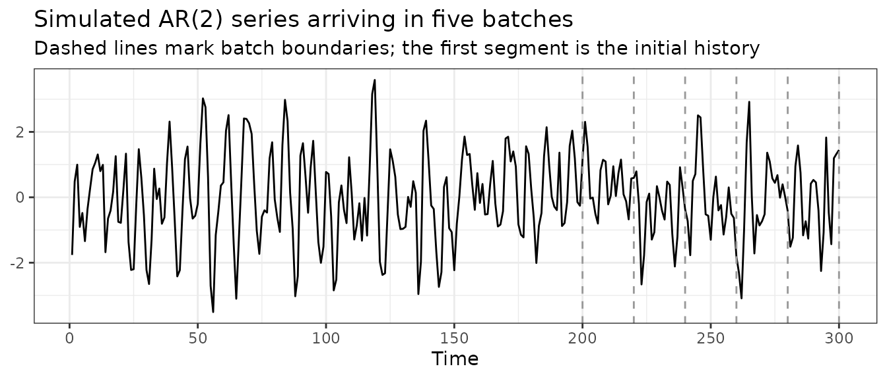

# Updating conformal forecasts with new data

## Introduction

The conformal methods are built on top of
[`cvforecast()`](https://xqnwang.github.io/conformalForecast/reference/cvforecast.md),
which fits a forecasting model repeatedly on a rolling or expanding
origin and records the resulting errors. This vignette deals with a
narrower practical problem: what to do when new observations arrive
after the pipeline has already been fitted.

One answer is to start over. Append the new observations to the series,
then call
[`cvforecast()`](https://xqnwang.github.io/conformalForecast/reference/cvforecast.md)
and the conformal method again on the whole thing. This is correct, but
wasteful. The forecasting model is fitted again at every rolling origin,
including all the origins that were fitted the previous time, and the
conformal calibration is repeated for every historical time step whose
prediction interval has already been computed and reported.

The [`update()`](https://rdrr.io/r/stats/update.html) method does the
same job with less work. It appends the new data, computes forecasts
only for the newly added origins, and continues the conformal
calibration from the point it had reached. Prediction intervals that
were already issued do not change, and the result is the same one you
would obtain by refitting on the full series.

``` r

library(conformalForecast)
library(forecast)
library(ggplot2)
```

## A streaming scenario

Suppose we forecast a series that is updated in batches. An initial
history is available, and new observations then arrive periodically,
whether as daily closing prices, monthly readings or sensor batches. At
each arrival we want prediction intervals for the next `h` steps that
reflect all the data seen so far.

We simulate such a stream from an AR(2) model, at a scale that keeps
this document quick to render: 200 initial observations, followed by
five batches of 20 observations each, giving a final series of length
300.

``` r

set.seed(101)
n0 <- 200
n_batch <- 20
n_batches <- 5
total_n <- n0 + n_batch * n_batches

series_full <- arima.sim(n = total_n, list(ar = c(0.8, -0.5)), sd = sqrt(1))
old_series <- ts(series_full[1:n0])
batches <- split(
  as.numeric(series_full[(n0 + 1):total_n]),
  rep(seq_len(n_batches), each = n_batch)
)

autoplot(series_full) +
  geom_vline(xintercept = n0 + n_batch * (0:n_batches), linetype = "dashed",
             colour = "grey60") +
  labs(
    title = "Simulated AR(2) series arriving in five batches",
    subtitle = "Dashed lines mark batch boundaries; the first segment is the initial history",
    x = "Time", y = NULL
  ) +
  theme_bw()
```



The forecasting model is an AR(2) fitted with
[`Arima()`](https://pkg.robjhyndman.com/forecast/reference/Arima.html),
as in the main vignette. A naive forecaster is used as the scorecaster
for
[`pid()`](https://xqnwang.github.io/conformalForecast/reference/pid.md).

``` r

far2 <- function(x, h, level) {
  Arima(x, order = c(2, 0, 0)) |> forecast(h = h, level = level)
}
naivefun <- function(x, h) {
  naive(x) |> forecast(h = h)
}
```

All four conformal methods take the same `cvforecast` object, so we
calibrate each of them and follow all four through the stream. The fits
are built with
[`conformal()`](https://xqnwang.github.io/conformalForecast/reference/conformal.md),
which takes the method as its `method` argument instead of requiring a
different function name for each one. Collecting the four fits in a list
lets the loops below treat them uniformly.

``` r

h <- 3
level <- 95
window_len <- 50
ncal <- 40
Tg <- 200
KI <- 2

fc0 <- cvforecast(old_series, forecastfun = far2, h = h, level = level,
                  window = window_len, initial = 1)
cps_list <- NULL
cps_list[["scp"]] <- conformal(fc0, method = "scp", ncal = ncal, rolling = TRUE)
cps_list[["acp"]] <- conformal(fc0, method = "acp", ncal = ncal, rolling = TRUE)
cps_list[["pid"]] <- conformal(fc0, method = "pid", ncal = ncal, rolling = TRUE, 
                               scorecastfun = naivefun, Tg = Tg, KI = KI)
cps_list[["acmcp"]] <- conformal(fc0, method = "acmcp", ncal = ncal, rolling = TRUE, 
                                 KI = KI, Tg = Tg)
scp_initial <- cps_list$scp
```

Each element of `cps_list` holds the state of one pipeline after the
initial 200 observations. Nothing here is update-specific:
`conformal(fc0, method = "scp", ...)` is the same call as
`scp(fc0, ...)`, and likewise for the other three.

## Updating as new data arrives

As each batch arrives, we pass it to
[`update()`](https://rdrr.io/r/stats/update.html) together with
`forecastfun`. The same call serves all four methods, because
[`update()`](https://rdrr.io/r/stats/update.html) dispatches on the
class of the object it is given and replays the settings recorded in it.

``` r

timings_update <- matrix(
  0, nrow = n_batches, ncol = length(cps_list),
  dimnames = list(paste("batch", seq_len(n_batches)), names(cps_list))
)

for (b in seq_len(n_batches)) {
  for (m in names(cps_list)) {
    timings_update[b, m] <- system.time(
      cps_list[[m]] <- update(cps_list[[m]], new_data = batches[[b]], forecastfun = far2)
    )["elapsed"]
  }
}
round(timings_update, 3)
#>           scp   acp   pid acmcp
#> batch 1 0.136 0.142 0.213 0.459
#> batch 2 0.137 0.141 0.212 0.471
#> batch 3 0.137 0.142 0.211 0.459
#> batch 4 0.139 0.142 0.212 0.574
#> batch 5 0.141 0.143 0.216 0.460
```

That is the whole streaming loop: five calls to
[`update()`](https://rdrr.io/r/stats/update.html) per method, each doing
only the work required by the 20 new observations in that batch.

## The cost of refitting from scratch

For comparison, we repeat the same five arrivals but rebuild the
pipeline completely at each step. The batch is appended to the series,
[`cvforecast()`](https://xqnwang.github.io/conformalForecast/reference/cvforecast.md)
is called on the full history, and every method is calibrated again from
the beginning. A single
[`cvforecast()`](https://xqnwang.github.io/conformalForecast/reference/cvforecast.md)
fit is shared by the four methods at each step, since computing it four
times over would overstate the cost of this approach.

``` r

current_series <- old_series
timings_full <- matrix(
  0, nrow = n_batches, ncol = length(cps_list) + 1L,
  dimnames = list(paste("batch", seq_len(n_batches)),
                  c("cvforecast", names(cps_list)))
)

for (b in seq_len(n_batches)) {
  current_series <- ts(c(current_series, batches[[b]]))
  timings_full[b, "cvforecast"] <- system.time(
    fc_full <- cvforecast(current_series, forecastfun = far2, h = h, level = level,
                          window = window_len, initial = 1)
  )["elapsed"]
  timings_full[b, "scp"] <- system.time(
    conformal(fc_full, method = "scp", ncal = ncal, rolling = TRUE)
  )["elapsed"]
  timings_full[b, "acp"] <- system.time(
    conformal(fc_full, method = "acp", ncal = ncal, rolling = TRUE)
  )["elapsed"]
  timings_full[b, "pid"] <- system.time(
    conformal(fc_full, method = "pid", ncal = ncal, rolling = TRUE, 
                               scorecastfun = naivefun, Tg = Tg, KI = KI)
  )["elapsed"]
  timings_full[b, "acmcp"] <- system.time(
    conformal(fc_full, method = "acmcp", ncal = ncal, rolling = TRUE, 
                                 KI = KI, Tg = Tg)
  )["elapsed"]
}
round(timings_full, 3)
#>         cvforecast   scp   acp   pid acmcp
#> batch 1      0.942 0.169 0.185 0.693 2.377
#> batch 2      1.057 0.199 0.212 0.798 2.740
#> batch 3      1.154 0.223 0.240 0.897 3.199
#> batch 4      1.264 0.250 0.268 1.005 3.444
#> batch 5      1.370 0.275 0.297 1.108 3.899
```

The cost of the
[`cvforecast()`](https://xqnwang.github.io/conformalForecast/reference/cvforecast.md)
step grows with every batch. At `batch = 5` it fits the AR(2) model at
essentially every rolling origin of a 300-point series, most of which
were already fitted during the previous four iterations. In the
[`update()`](https://rdrr.io/r/stats/update.html) loop that cost stays
roughly constant instead, because each call only touches the
observations that have just arrived.

## What `update()` expects

Three points are worth keeping in mind when calling
[`update()`](https://rdrr.io/r/stats/update.html).

`forecastfun` has to be supplied again at every call. It is not stored
on the object, and it should be the same function used to build the
original
[`cvforecast()`](https://xqnwang.github.io/conformalForecast/reference/cvforecast.md)
object, since it is used to fit the model at the newly added origins.

The object being updated has to come from one of the conformal methods
in the package. [`update()`](https://rdrr.io/r/stats/update.html) reads
the settings recorded when the object was built, and reports an error if
they are not available rather than falling back on defaults.

[`update()`](https://rdrr.io/r/stats/update.html) preserves the
calibration settings stored in the fitted object. Arguments supplied
through `...` are forwarded to `forecastfun`; they do not override the
conformal configuration. Consequently, calibration parameters such as
`ncal`, `lr` and `KI` should not be supplied to
[`update()`](https://rdrr.io/r/stats/update.html). A different
calibration specification requires refitting the conformal method with
the desired parameter values.

## Exogenous regressors

If the original
[`cvforecast()`](https://xqnwang.github.io/conformalForecast/reference/cvforecast.md)
object used `xreg`, [`update()`](https://rdrr.io/r/stats/update.html)
accepts a matching `new_xreg` and extends the stored regressors with it.
The number of rows in `new_xreg` must match the number of new
observations.

``` r

set.seed(202)
n_x <- 60
xreg_full <- matrix(rnorm(n_x + 10), ncol = 1)
y_x <- ts(as.numeric(arima.sim(n = n_x, list(ar = 0.5))) + 2 * xreg_full[1:n_x, 1])

lm_fun <- function(x, h, level, xreg, newxreg) {
  Arima(x, order = c(1, 0, 0), xreg = xreg) |>
    forecast(h = h, level = level, xreg = newxreg)
}

fc_x <- cvforecast(y_x, forecastfun = lm_fun, h = 2, level = 95, window = 30,
                   initial = 1, xreg = xreg_full[1:(n_x + 2), , drop = FALSE])
cp_x <- scp(fc_x, ncal = 20, rolling = TRUE)
```

`cp_x$xreg` has 62 rows: the 60 historical values, plus the 2 future
values needed for the last `h = 2` forecast. When 5 observations are
appended, these 2 stored future values become the regressors for the
first 2 new observations. Therefore, `new_xreg` supplies exactly 5
subsequent rows: the first 3 complete the regressor history for the new
observations, and the final 2 preserve the future `h = 2` forecast
horizon.

``` r

new_y <- as.numeric(arima.sim(n = 5, list(ar = 0.5))) + 2 * xreg_full[(n_x + 1):(n_x + 5), 1]
new_xreg <- xreg_full[(n_x + 3):(n_x + 7), , drop = FALSE]

cp_x_upd <- update(cp_x, new_data = new_y, forecastfun = lm_fun, new_xreg = new_xreg)
```

## The `forward` forecast

When the original
[`cvforecast()`](https://xqnwang.github.io/conformalForecast/reference/cvforecast.md)
object was built with `forward = TRUE`, which is the default, it carries
`mean`, `lower` and `upper` components holding the out-of-sample
forecast from the most recent origin. After the new data have been
appended, [`update()`](https://rdrr.io/r/stats/update.html) refits the
model at the new final origin, so that these components describe a
forecast made from all the data now available.

``` r

scp_initial$mean
#> Time Series:
#> Start = 201 
#> End = 203 
#> Frequency = 1 
#> [1] 1.1155681 0.4993606 0.1030395
scp_upd <- update(scp_initial, new_data = batches[[1]], forecastfun = far2)
scp_upd$mean
#> Time Series:
#> Start = 221 
#> End = 223 
#> Frequency = 1 
#> [1] 0.4228521 0.3087081 0.3112907
```

The forecast origin moves from the end of the initial 200 observations
to the end of the 220 now available, as it would after a fresh
[`cvforecast()`](https://xqnwang.github.io/conformalForecast/reference/cvforecast.md)
call on the extended series.

## Summary

[`update()`](https://rdrr.io/r/stats/update.html) extends a fitted
conformal pipeline with new observations and returns the same result as
rebuilding it from scratch, at a fraction of the cost. Prediction
intervals that have already been issued are left unchanged, and the
saving grows with the length of the accumulated history. Supply
`forecastfun` at every call, keep the calibration settings fixed, and
pass `new_xreg` when the original object used exogenous regressors.
